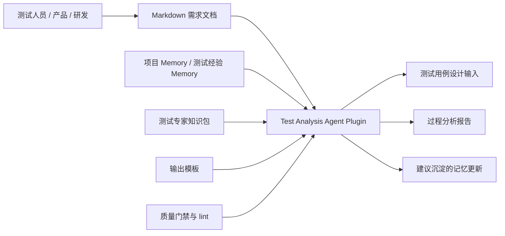
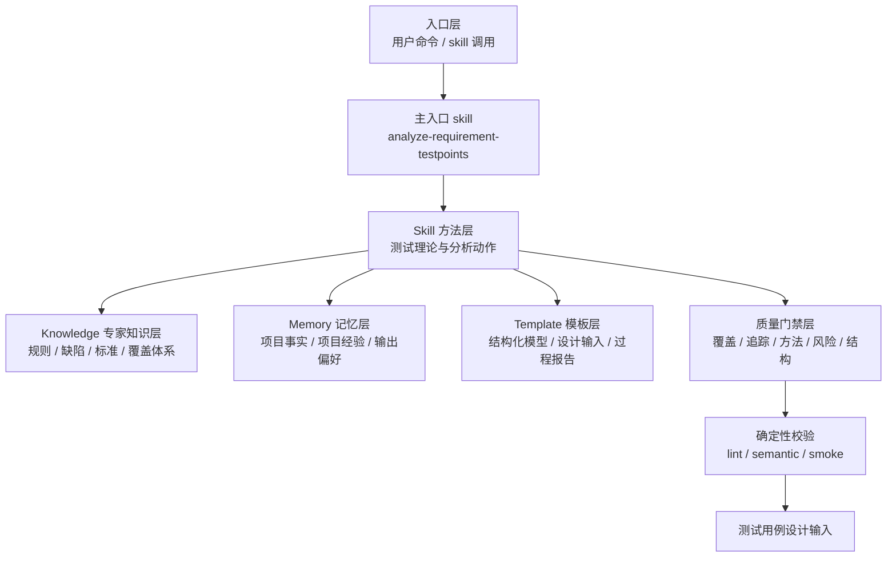
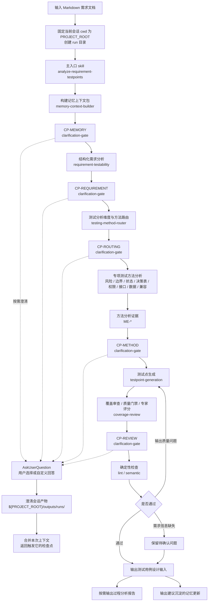
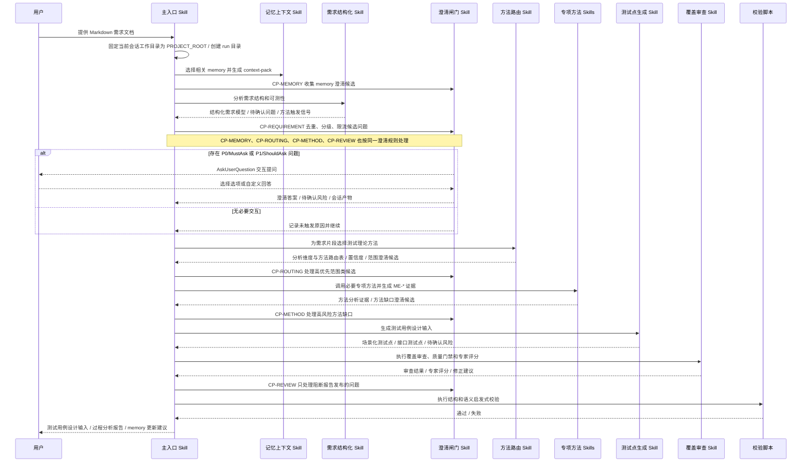
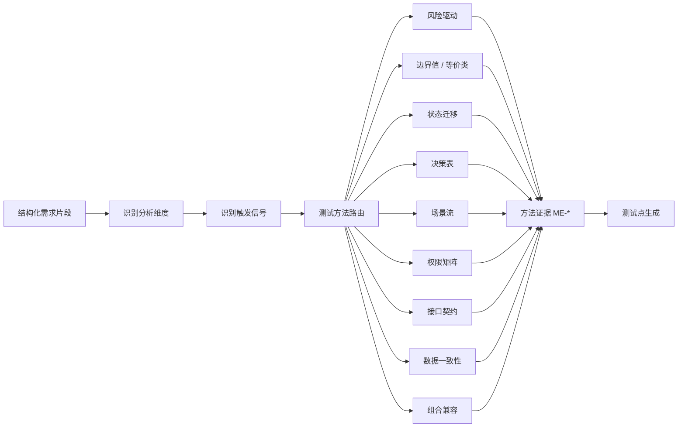
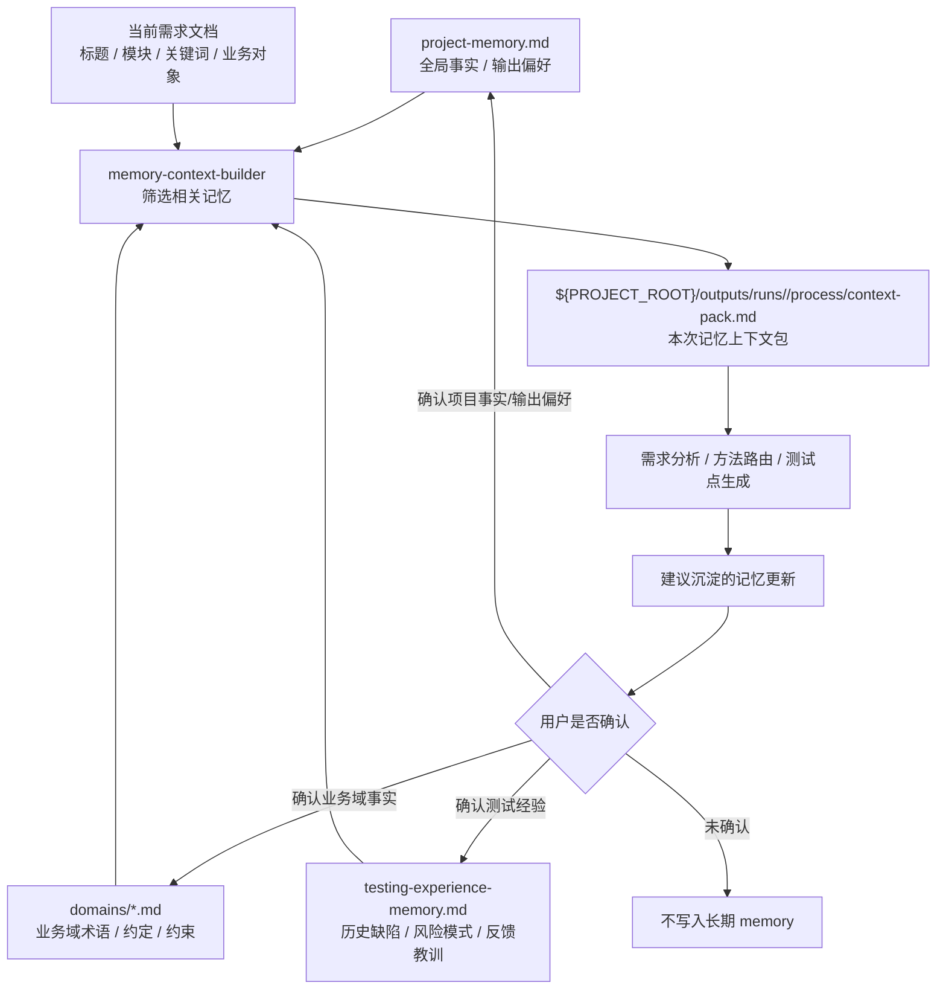
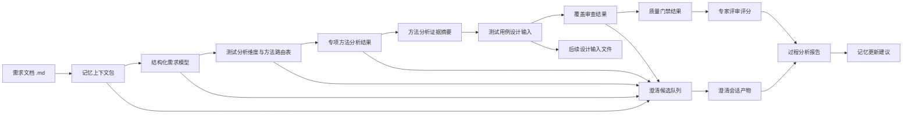
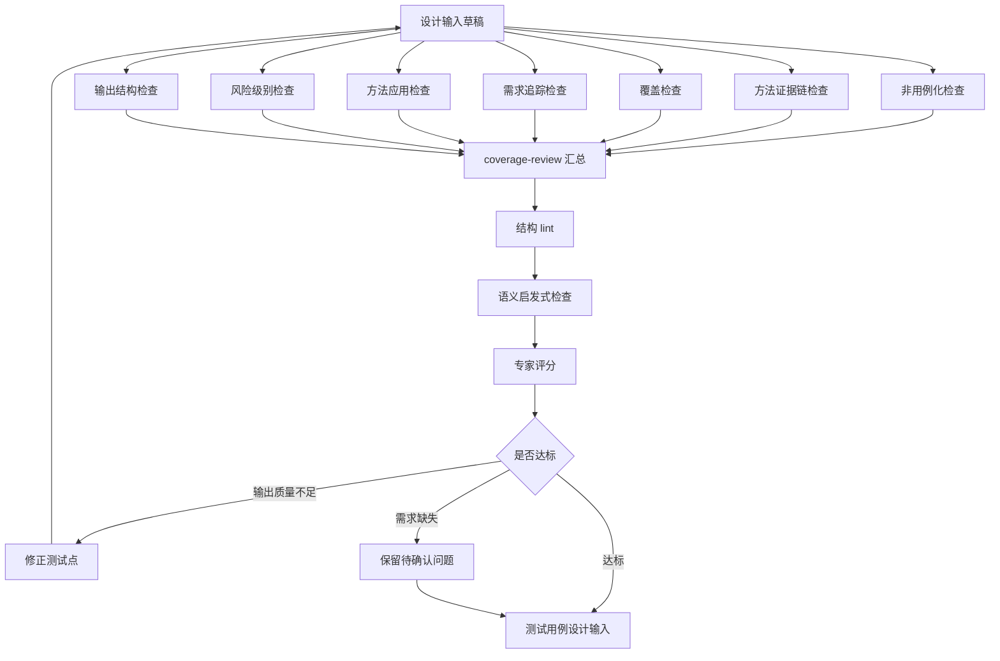

# 测试分析 Agent 整体架构设计

## 1. 文档目的

本文描述测试分析 Agent 的系统架构、运行流程、组件职责和质量闭环。该 Agent 面向 Markdown 需求文档，目标是模拟测试专家的分析过程，输出后续独立测试设计项目可直接消费的“测试用例设计输入”，而不是测试用例、测试步骤或自动化脚本。

设计优先适配 Claude Code plugin / skills 和 OpenCode project / skills / commands 体系，同时保持核心知识、方法和模板平台无关。

## 2. 设计目标与边界

### 2.1 目标

- 输入单个 Markdown 需求文档。
- 解析需求并形成结构化需求模型。
- 基于测试分析维度选择合适分析方法，包括需求可测性、风险、业务场景、数据域、规则组合、状态、权限、接口契约、数据一致性、组合兼容和非功能质量属性。
- 为每种必选测试方法输出 `ME-*` 方法分析证据，证明测试理论被实际应用。
- 结合 memory 注入项目上下文、历史缺陷、测试经验和输出偏好。
- 输出按测试场景组织、包含共用条件和测试点的设计输入。
- 输出交付件必须自包含，后续独立测试设计项目只读取该文件也能开展用例设计。
- 可选保留中等粒度、可评审、可追踪的过程分析报告。
- 通过质量门禁和确定性 lint 做自我审查。

### 2.2 非目标

- 不生成测试用例。
- 不生成测试执行步骤。
- 不生成自动化脚本。
- 不引入数据库、向量检索或服务端。
- 不在需求不清楚时编造业务规则。

## 3. 架构原则

| 原则 | 说明 |
|---|---|
| 分析维度显式化 | 每个需求片段先识别测试分析维度，再经过方法路由和方法证据沉淀，最后生成设计输入 |
| 方法证据可追踪 | 每个必选测试方法都应产出 `ME-*` 证据，或输出待确认问题解释缺口 |
| 专家经验可维护 | 测试标准、缺陷模式、覆盖分类、判定依据使用 Markdown 知识包维护 |
| 记忆可控注入 | 每次分析只生成相关记忆上下文包，不全量注入 memory |
| 输出非用例化 | 测试点是对验证特性的细化，描述被测对象在特定场景下的某一功能，不写前置条件、步骤、数据和完整预期 |
| 质量闭环 | 生成后必须经过覆盖、追踪、方法应用、风险级别和结构校验 |
| 平台薄适配 | Claude Code / OpenCode 只作为运行容器，核心测试逻辑沉淀在 Markdown 文件中 |

## 4. 系统上下文视图



系统对外只暴露一个核心能力：基于需求文档生成测试用例设计输入。稳定入口和流程真相是主 skill；knowledge、memory、template 和 quality gate 为主流程提供支撑。

## 5. 目录结构视图

```text
test-analysis-agent/
├── .claude-plugin/
│   └── plugin.json
├── .opencode/
│   ├── commands/
│   │   └── analyze-requirement-testpoints.md
│   └── skills/
│       └── <generated from skills/>
├── AGENTS.md
├── CLAUDE.md
├── opencode.json
├── skills/
│   ├── analyze-requirement-testpoints/
│   ├── testing-method-router/
│   ├── requirement-testability/
│   ├── clarification-gate/
│   ├── risk-based-test-analysis/
│   ├── boundary-equivalence-analysis/
│   ├── state-transition-analysis/
│   ├── decision-table-analysis/
│   ├── scenario-flow-analysis/
│   ├── permission-role-analysis/
│   ├── interface-contract-analysis/
│   ├── data-consistency-analysis/
│   ├── combinatorial-compatibility-analysis/
│   ├── memory-context-builder/
│   ├── testpoint-generation/
│   └── coverage-review/
├── knowledge/
├── memory/
│   ├── README.md
│   ├── project-memory.md
│   ├── domains/
│   │   └── *.md
│   └── testing-experience-memory.md
├── templates/
├── quality-gates/
├── bin/
│   ├── lint-testpoint-report.py
│   ├── lint-testcase-design-input.py
│   ├── semantic-testpoint-check.py
│   ├── check-artifact-consistency.py
│   ├── smoke-test-analysis.py
│   ├── sync-opencode-skills.py
│   └── validate-agent-runtime.py
├── examples/
└── outputs/
    └── runs/
        └── <run-id>/
            ├── deliverables/
            │   └── testcase-design-input.md
            ├── process/
            │   ├── context-pack.md
            │   └── clarification-session.md
            ├── reports/
            │   └── test-analysis-report.md
            └── legacy/                  # 按需
                └── testpoint-details.md
```

### 5.1 目录职责

| 目录 | 职责 |
|---|---|
| `.claude-plugin/` | Claude Code plugin manifest |
| `.opencode/` | OpenCode 命令和 skill 发现目录；其中 `.opencode/skills/` 由 `skills/` 同步生成 |
| `AGENTS.md` | OpenCode 项目规则入口 |
| `CLAUDE.md` | Claude Code 项目规则入口 |
| `opencode.json` | OpenCode 项目配置，声明 schema 和 skill 权限 |
| `skills/` | 测试分析方法能力，是手工维护的 skill 唯一事实源 |
| `knowledge/` | 稳定专家知识、缺陷模式、测试标准、覆盖体系 |
| `memory/` | 经人工确认的项目上下文、领域事实和测试经验 |
| `templates/` | 中间产物、设计输入和过程报告格式 |
| `quality-gates/` | Agent 可读的质量门禁规则 |
| `bin/` | 可机械执行的结构 lint、语义启发式检查、runtime 适配校验和 smoke 回归脚本 |
| `examples/` | 回归样例需求和输出 |
| `outputs/` | 基于项目根目录保存的运行产物、测试用例设计输入和过程分析报告 |

### 5.2 Claude Code 与 OpenCode 兼容性

本仓库采用 Claude Code plugin 与 OpenCode project 双入口结构：

- Claude Code 通过 `.claude-plugin/plugin.json` 直接加载根目录 `skills/`。
- OpenCode 通过 `opencode.json`、`.opencode/commands/analyze-requirement-testpoints.md` 和 `.opencode/skills/` 发现项目能力。
- `skills/<skill-name>/SKILL.md` 是唯一手工维护的 skill 源。
- `.opencode/skills/` 是由 `bin/sync-opencode-skills.py` 从 `skills/` 生成的镜像，不作为人工维护入口。

修改任何 `skills/*/SKILL.md` 后，必须重新运行：

```text
python bin/sync-opencode-skills.py
python bin/validate-agent-runtime.py
```

调用建议：

- 面向用户的稳定入口是主 skill：`analyze-requirement-testpoints`。
- 所有阶段性能力由主入口 skill 串联各专项 skill 完成，不再内置协作代理定义。

## 6. 分层架构视图



### 6.1 分层职责边界

```text
Skill = 主流程和分析动作，定义怎么分析、何时触发某种测试理论
Knowledge = 使用哪些稳定测试知识、专家规则、缺陷模式和标准
Memory = 当前项目和历史反馈中已经确认、且会影响本次分析的上下文
Template = 中间产物、设计输入和过程报告长什么样
Quality Gate = 输出是否达到测试专家评审标准
bin = 对报告结构和非用例化约束做机械校验
```

### 6.2 分层内容边界

| 层 | 放什么 | 不放什么 | 典型文件 |
|---|---|---|---|
| Knowledge | 通用测试理论、分析维度、框架术语、测试点标准、缺陷模式、方法路由矩阵、覆盖分类、专家评分标准 | 项目事实、临时偏好、单次运行结果、未确认业务规则 | `knowledge/test-analysis-methodology.md`、`knowledge/domain-glossary.md`、`knowledge/testpoint-standard.md` |
| Skills | 触发条件、输入、分析步骤、输出格式引用、质量检查顺序 | 长篇理论定义、通用缺陷清单、级别定义、项目事实 | `skills/testing-method-router/SKILL.md`、`skills/testpoint-generation/SKILL.md` |
| Memory | 经人工确认的项目事实、项目专属术语、业务域约定、输出偏好、项目历史缺陷、项目反馈教训 | 通用测试理论、框架术语、通用缺陷模式、方法步骤、未确认假设 | `memory/project-memory.md`、`memory/domains/*.md`、`memory/testing-experience-memory.md` |
| Templates | Markdown 结构、字段占位、最小示例和产物布局 | 标准枚举的独立定义、项目事实、执行流程 | `templates/testcase-design-input-template.md`、`templates/final-report-template.md` |
| Quality Gates | 通过/失败条件、字段校验、结构校验和风险校验 | 新测试理论、新业务规则、另一套标准定义 | `quality-gates/output-schema-check.md`、`quality-gates/method-application-check.md` |
| bin | 可机械执行的结构、语义和回归检查 | 不可解释的专家判断、项目事实、运行流程编排 | `bin/lint-testpoint-report.py`、`bin/semantic-testpoint-check.py` |

详细规则见 `docs/knowledge-skill-memory-boundaries.md`。

## 7. 主运行流程视图



## 8. 主流程视图

以下时序以主入口 skill 为准。主 skill 负责串联各阶段 skill，并统一管理检查点、产物路径、澄清规则和质量门禁。



## 9. 测试分析维度与方法路由架构视图

测试分析维度与方法路由是系统替代测试专家的核心。它先判断需求片段需要从哪些分析维度审视，再把需求信号映射到测试理论，而不是让模型直接泛化生成测试点。



### 9.1 路由矩阵摘要

| 分析维度 | 需求信号 | 测试方法 | 对应 skill | 路由输出 |
|---|---|---|---|---|
| 数据域与边界 | 范围、阈值、枚举、格式、数量、时间窗口 | 边界值、等价类 | `boundary-equivalence-analysis` | 必要性、置信度、说明 |
| 状态与生命周期 | 生命周期、工作流、审批、取消、重试、超时 | 状态迁移 | `state-transition-analysis` | 必要性、置信度、说明 |
| 业务规则组合 | 多条件共同决定结果 | 决策表 | `decision-table-analysis` | 必要性、置信度、说明 |
| 业务场景与流程 | 主流程、备选流程、异常流程、端到端旅程 | 场景流 | `scenario-flow-analysis` | 必要性、置信度、说明 |
| 权限与数据范围 | 角色、租户、数据范围、归属、审批权限 | 权限矩阵 | `permission-role-analysis` | 必要性、置信度、说明 |
| 接口与契约 | API、字段、响应、错误码、回调、外部系统 | 接口契约 | `interface-contract-analysis` | 必要性、置信度、说明 |
| 数据一致性 | 库存、缓存、统计、导出、日志、异步同步 | 数据一致性 | `data-consistency-analysis` | 必要性、置信度、说明 |
| 组合与兼容 | 多平台、多版本、多配置、多渠道、feature flag | 组合兼容 | `combinatorial-compatibility-analysis` | 必要性、置信度、说明 |
| 风险与优先级 | 资金、安全、不可逆、历史缺陷、高用户影响 | 风险驱动 | `risk-based-test-analysis` | 必要性、置信度、说明 |

## 10. Memory 设计

### 10.1 Memory 定义

Memory 是 Agent 在多次需求分析之间保留的、经人工确认的项目上下文和测试经验。它用于让测试分析更贴近当前项目，而不是替代需求文档或专家知识库。

长期 Memory 只保存两类内容：

- 项目事实：业务模块、角色、项目专属术语、接口约定、数据对象、输出偏好。
- 测试经验：项目历史缺陷、已确认风险模式、评审反馈、团队测试习惯。

本次上下文包是从长期 memory 中筛选出的运行产物，写入 `${PROJECT_ROOT}/outputs/runs/<run-id>/process/context-pack.md`，不属于长期 Memory。

Memory 不保存：

- 通用测试理论和通用缺陷模式。稳定知识放在 `knowledge/`，分析动作放在 `skills/`。
- 未确认的业务规则。未确认内容应放在“待确认问题”或“建议沉淀的 Memory 更新”。
- 单次运行的完整中间产物。context pack、澄清会话、结构化需求模型、设计输入草稿和审查结果归属 `outputs/`。

### 10.2 Memory 文件结构

```text
memory/
├── README.md
├── project-memory.md
├── domains/
│   └── *.md
└── testing-experience-memory.md
```

| 文件 | 作用 | 更新方式 |
|---|---|---|
| `README.md` | 说明 memory 的定义、边界和使用方法 | 随架构调整更新 |
| `project-memory.md` | 保存项目全局事实、全局约束、输出偏好和项目专属术语覆盖 | 用户确认后人工追加 |
| `domains/*.md` | 保存用户自定义业务域的术语、角色权限、接口/数据约定和设计约束 | 用户确认后人工追加；新增分片自动扫描，无需登记索引 |
| `testing-experience-memory.md` | 保存项目历史缺陷、项目风险模式、评审反馈和团队测试习惯 | 用户确认后人工追加 |

运行时上下文包写入 `${PROJECT_ROOT}/outputs/runs/<run-id>/process/context-pack.md`，不放在 `memory/` 目录中。

### 10.3 记忆注入与更新视图



### 10.4 使用方法

1. 运行开始时，先读取 `project-memory.md` 的全局内容。
2. 自动扫描 `domains/*.md`，跳过 `README.md`，根据需求标题、模块、角色、业务对象、状态、接口、关键词和分片自身元信息选择相关分片。
3. 同时检索 `testing-experience-memory.md` 中与本次需求相关的项目经验。
4. 只摘取与本次需求直接相关的内容，生成 `${PROJECT_ROOT}/outputs/runs/<run-id>/process/context-pack.md`。
5. 需求分析、方法路由、测试点生成和覆盖审查只读取当前 run 的 `context-pack.md`，避免长期 memory 全量注入。
6. 过程分析报告输出“建议沉淀的 Memory 更新”，说明建议写入哪个长期文件或业务域分片、依据是什么。
7. 只有用户明确确认后，才把建议追加到 `project-memory.md`、`domains/*.md` 或 `testing-experience-memory.md`。

### 10.5 写入原则

- 有证据：必须来自需求文档、用户明确反馈、评审结论或真实缺陷复盘。
- 可复用：能影响后续需求分析，而不是只对当前报告有用。
- 原子化：一条 memory 只表达一个事实、偏好或经验。
- 可追踪：注明来源、日期或触发需求。
- 不污染：不把猜测、临时假设、通用测试理论写入 memory。

## 11. 数据与产物流视图



### 11.1 中间产物

| 产物 | 来源 | 作用 |
|---|---|---|
| 记忆上下文包 | `memory-context-builder` | 注入本次相关的项目语境和测试经验，并在运行目录保留快照 |
| 结构化需求模型 | `requirement-testability` | 提取模块、规则、状态、接口、权限和待确认问题 |
| 澄清候选队列 | 各阶段 skill | 使用统一 `CQ-*` schema 记录标题、问题、原因、影响、选项、阻塞级别、优先级、提问策略、必问标记和关联依据 |
| 澄清会话产物 | `clarification-gate` | 记录 AskUserQuestion 问题队列、未触发原因、用户回答、已解决问题和刷新后的未解决待确认问题 |
| 测试分析维度与方法路由表 | `testing-method-router` | 决定每段需求从哪些分析维度审视并使用哪些测试理论 |
| 方法分析证据摘要 | 专项测试方法 skills | 证明测试理论被实际应用，并关联测试点或待确认问题 |
| 测试用例设计输入 | `testpoint-generation` | 输出场景化测试点、场景测试条件、接口清单和接口测试点 |
| 覆盖审查结果 | `coverage-review` | 判断覆盖是否充分 |
| 质量门禁结果 | `quality-gates/` | 判断是否满足输出质量要求 |
| 专家评审评分 | `expert-review-rubric.md` | 衡量是否达到测试专家最低标准 |

### 11.2 运行目录

每次分析必须先固定 `PROJECT_ROOT`，再创建独立运行目录，避免多次执行覆盖历史产物。`PROJECT_ROOT` 的规则是：使用用户启动 Claude Code、OpenCode 或当前 agent 会话所在的工作目录。需求文档路径只用于读取需求，不用于反推项目根目录。

```text
${PROJECT_ROOT}/outputs/runs/<run-id>/
├── deliverables/
│   └── testcase-design-input.md
├── process/
│   ├── context-pack.md
│   └── clarification-session.md
├── reports/
│   └── test-analysis-report.md
└── legacy/                  # 按需
    └── testpoint-details.md
```

`run-id` 格式为 `<YYYYMMDD-HHMMSS>-<需求文件名安全短名>-<短哈希>`。run 目录用于区分历史批次，run 内文件名必须固定，避免不同模型或环境生成不同文件名影响下游消费。`deliverables/testcase-design-input.md` 是唯一跨项目交付件；`process/context-pack.md` 是该 run 的上下文快照；`process/clarification-session.md` 只在发生澄清或需要记录未触发原因时生成；`reports/test-analysis-report.md` 是可选过程审查报告；`legacy/testpoint-details.md` 仅用于兼容旧流程，不默认生成。当前任务内继续修改时复用同一运行目录，历史追溯以对应 run 目录为准。报告中可以展示相对路径 `outputs/runs/<run-id>/...`，但实际写文件必须使用 `${PROJECT_ROOT}` 下的绝对路径。

不得在 `skills/`、`.claude-plugin/`、`.opencode/`、插件缓存目录或 skill 工作目录下创建 `outputs/runs/`。如果当前工作目录明显是这些禁止目录，必须先向用户确认正确工作目录，不得继续生成产物。后续阶段不得重新解析、搜索或修正 `PROJECT_ROOT`。

## 12. 质量闭环视图



### 12.1 质量门禁

| 门禁 | 检查重点 |
|---|---|
| `testpoint-not-testcase-check.md` | 是否误写成测试用例 |
| `coverage-check.md` | 模块、主流程、异常、边界、状态、权限、接口、数据是否覆盖 |
| `traceability-check.md` | 每条测试点是否有需求依据 |
| `method-application-check.md` | 必选分析维度和测试方法是否有测试点或待确认问题 |
| `risk-priority-check.md` | 高风险点是否被优先覆盖 |
| `output-schema-check.md` | 设计输入章节、字段和级别是否合法 |
| `semantic-quality-check.md` | 方法应用、风险备注、依据粒度和明细一致性是否达标 |
| `bin/lint-testpoint-report.py` | 机械检查章节、表头、ID、类型、方法、禁用用例字段 |
| `bin/semantic-testpoint-check.py` | 启发式检查方法覆盖、类型方法匹配、风险备注和依据质量 |
| `bin/check-artifact-consistency.py` | 检查固定运行目录以及主交付件、过程报告、兼容明细之间的 `TP-*` / `ITP-*` 一致性 |
| `bin/smoke-test-analysis.py` | 对固定 run 示例执行结构 lint、语义检查、跨产物一致性和明细一致性回归 |
| `bin/sync-opencode-skills.py` | 将根目录 `skills/` 同步到 `.opencode/skills/`，并校验 OpenCode skill frontmatter |
| `bin/validate-agent-runtime.py` | 校验 Claude Code manifest、OpenCode 配置、命令入口和 skill 镜像一致性 |

## 13. 组件职责

### 13.1 Skills

| 类型 | Skill |
|---|---|
| 主入口 | `analyze-requirement-testpoints` |
| 需求理解 | `requirement-testability` |
| 交互澄清 | `clarification-gate` |
| 方法路由 | `testing-method-router` |
| 风险分析 | `risk-based-test-analysis` |
| 测试理论 | `boundary-equivalence-analysis`、`state-transition-analysis`、`decision-table-analysis`、`scenario-flow-analysis`、`permission-role-analysis`、`interface-contract-analysis`、`data-consistency-analysis`、`combinatorial-compatibility-analysis` |
| 记忆注入 | `memory-context-builder` |
| 生成与审查 | `testpoint-generation`、`coverage-review` |

### 13.2 Knowledge

| 文件 | 作用 |
|---|---|
| `test-analysis-methodology.md` | 定义测试分析与测试设计边界、分析维度和主交付件落点 |
| `test-scenario-point-case-boundary.md` | 定义需求、测试场景、场景测试条件、测试点和测试用例的层级边界 |
| `basic-test-types.md` | 定义设计输入使用的测试类型大类和子类 |
| `expert-rules.md` | 稳定专家规则 |
| `defect-patterns.md` | 结构化缺陷模式卡片 |
| `risk-level-rules.md` | 风险级别判定规则 |
| `method-evidence-standard.md` | 测试方法证据标准 |
| `testpoint-standard.md` | 测试点标准 |
| `test-method-routing-matrix.md` | 分析维度、需求信号到测试方法映射 |
| `coverage-taxonomy.md` | 专家级覆盖分类 |
| `test-oracle-heuristics.md` | 测试判定依据启发 |
| `expert-review-rubric.md` | 专家评分标准 |
| `domain-glossary.md` | 框架与分析术语 |

### 13.3 Templates

| 文件 | 作用 |
|---|---|
| `requirement-model-template.md` | 结构化需求模型模板 |
| `testcase-design-input-template.md` | 后续独立测试设计项目主输入模板 |
| `testpoint-output-template.md` | 兼容保留的独立测试点明细模板 |
| `method-analysis-template.md` | 方法分析证据摘要模板 |
| `clarification-template.md` | AskUserQuestion 澄清问题和会话产物模板 |
| `coverage-review-template.md` | 覆盖审查模板 |
| `memory-update-proposal-template.md` | Memory 更新建议模板 |
| `final-report-template.md` | 过程分析报告模板 |
| `context-pack-template.md` | 记忆上下文包模板 |

## 14. 输出契约

测试用例设计输入实际写入路径：

```text
${PROJECT_ROOT}/outputs/runs/<run-id>/deliverables/testcase-design-input.md
```

过程分析报告建议写入路径：

```text
${PROJECT_ROOT}/outputs/runs/<run-id>/reports/test-analysis-report.md
```

澄清会话路径：

```text
${PROJECT_ROOT}/outputs/runs/<run-id>/process/clarification-session.md
```

上下文包快照路径：

```text
${PROJECT_ROOT}/outputs/runs/<run-id>/process/context-pack.md
```

完整运行产物分类和固定命名规则见 `docs/output-artifact-contract.md`。

测试用例设计输入结构：

```markdown
# <需求名称> 测试用例设计输入

## 1. 需求信息
## 2. 测试场景清单
## 3. 测试场景详情
## 4. 接口测试清单
## 5. 接口测试详情
## 6. 待确认信息
## 7. 输入完整性自检
```

`待确认信息` 必须在所有交互澄清完成后刷新，只保留后续设计可执行用例时必须知道的问题；已被用户回答、已被上下文覆盖或重复的问题不得出现在主输出中。

场景测试点字段：

| 测试点 ID | 测试点 | 大类 | 子类 | 级别 | 风险/备注 |
|---|---|---|---|---|---|

接口测试点字段：

| 测试点 ID | 测试点 | 大类 | 子类 | 风险/备注 |
|---|---|---|---|---|

过程分析报告可以保留方法分析证据字段：

| 证据ID | 方法 | 需求片段 | 分析结论 | 关联测试点/待确认 |
|---|---|---|---|---|

### 14.1 类型、方法和级别来源

设计输入中的 `场景测试类型`、`大类/子类` 和 `接口测试类型` 以 `knowledge/basic-test-types.md` 为准；测试分析与测试设计边界、分析维度和主交付件落点以 `knowledge/test-analysis-methodology.md` 为准；场景、场景测试条件、测试点和测试用例边界以 `knowledge/test-scenario-point-case-boundary.md` 为准。内部分析使用的测试点类型、测试方法枚举、粒度要求、非用例化约束和 `Level 0` 到 `Level 4` 的级别定义，以 `knowledge/testpoint-standard.md` 为准。

## 15. 验收标准

- 输入单个 Markdown 需求文档后，能输出测试用例设计输入。
- 输出内容按测试场景组织，每个场景都有入口/触发方式、执行用户/角色、前置条件、测试数据因子和业务设计约束。
- 主输出自包含，不依赖后续项目回读原始需求、过程报告、context-pack、memory 或 Analysis 项目文件。
- 测试点不包含步骤化测试用例内容、具体测试数据或完整预期结果。
- 每条测试点都有大类、子类、级别和风险备注，且 `测试点` 描述中体现被测对象、特定场景和验证特性。
- 能体现风险、边界、等价类、状态、权限、接口、决策表、场景流、数据一致性和组合兼容等测试理论。
- 能输出接口测试清单和接口测试详情，接口契约不混入页面或业务场景。
- 能输出刷新后的待确认信息。
- 过程分析报告能输出测试分析维度与方法路由表、方法分析证据摘要、质量门禁结果、专家评分和建议沉淀的记忆更新项。
- 示例主输出可通过 `bin/lint-testcase-design-input.py`，示例固定 run 可通过 `bin/check-artifact-consistency.py`，示例过程报告可通过 `bin/lint-testpoint-report.py`、`bin/semantic-testpoint-check.py` 和 `bin/smoke-test-analysis.py`。

## 16. 当前假设

- v1 只处理单个 Markdown 需求文档。
- v1 memory 使用 Markdown 文件维护。
- v1 memory 更新需要人工确认。
- v1 优先适配 Claude Code plugin / skills 和 OpenCode project / skills / commands。
- OpenCode 的 skill 镜像由 `skills/` 生成，不单独维护另一套流程。

## 17. 参考

- [Claude Code Plugins](https://code.claude.com/docs/en/plugins)
- [Claude Code Skills](https://code.claude.com/docs/en/skills)
